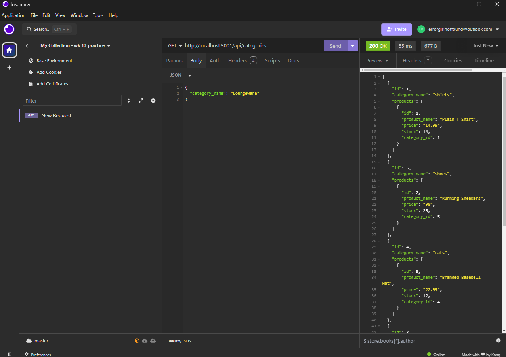

# EcomCore

EcomCore is the back end for your e-commerce website! Built with Express.js, this API uses Sequelize to interact with a PostgreSQL database. EcomCore lets you easily manage products, categories, and tags. 

- Connect to your PostgreSQL database by adding your database name, PostgreSQL username, and password to the environment variable file. Sequelize handles the connection for you.

- Set up a development database by running schema and seed commands, which create and populate the database with test data.

- Start your server with a single command. The application will sync the Sequelize models to the PostgreSQL database automatically.

-  Access API GET routes for categories, products, or tags in Insomnia to see data displayed in a well-organized JSON format.

- Test API POST, PUT, and DELETE routes in Insomnia to create, update, and delete data in your database efficiently.

## Installation

To install EcomCore:

- Clone the repository: https://github.com/girlnotfound/EcomCore

- Navigate to the project directory

- Open the terminal and install the dependencies by running the command: `npm install`

- Set up the PostgreSQL database:

  - Enter `psql -U postgres` to open the PostgreSQL command line interface. If prompted, input your password.
  - To set up the database, type `\i schema.sql` and press Enter.
  Now your database is ready to use!

- Remove '.EXAMPLE' from the .env.EXAMPLE file renaming it to .env

- Configure that .env file with your database credentials

- Seed data to your database so that you can test your routes, in the terminal run the command: `npm run seed`

## Usage

- Start the application, in the terminal run the command: `npm start`

[Link to Walk Through Video](https://app.screencastify.com/v3/watch/Q1HNtpZSEf2izyvmu67U)

## Credits

This project was made possible with the help of:

[Adam Rosenberg](https://github.com/AcoderRose)

[Ryan Petersen](https://github.com/RyanPetersen-89)